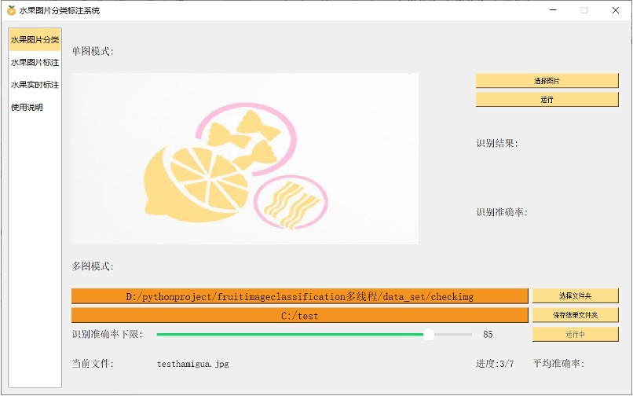
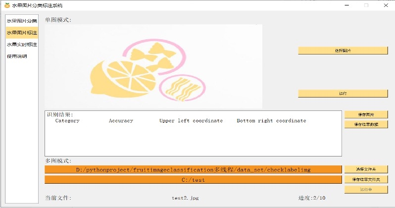
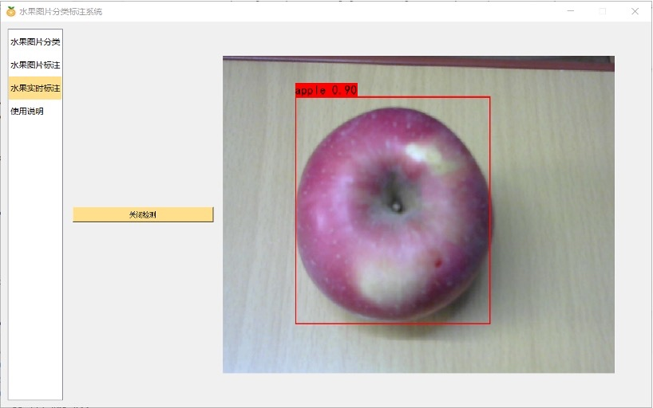
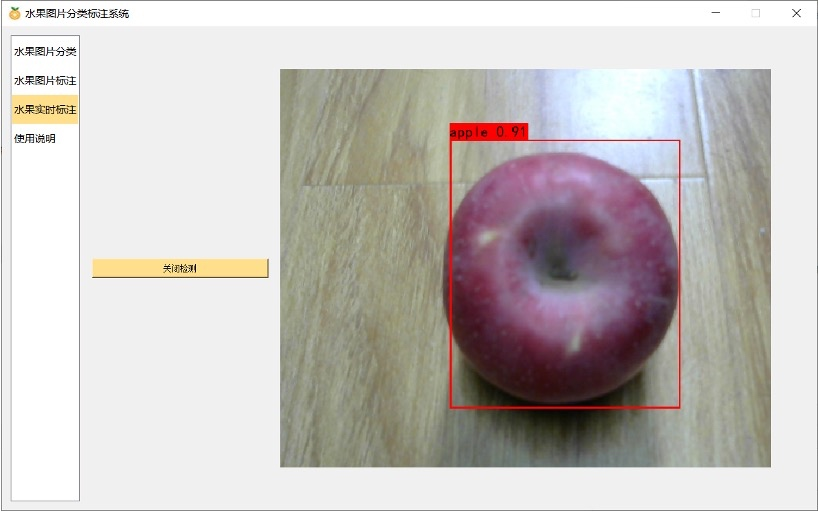

## 软件功能与使用方法简介
从文末的链接中下载权重文件并放入到项目目录中，然后需要搭建环境以及安装需要的库（搭建细节在论文中有介绍），最后在IDE或终端运行MainWindow.py文件即可启动软件，软件包括一下功能
 ### 水果图片分类功能
  #### 单图模式
单图模式下点击选择图片按钮选择图片，之后点击运行按钮，在已选择图片情况下，系统会调用由train.py训练好的权重文件（相关权重文件过大，可通过下面的网盘链接下载）对图片进行识别，然后返回识别结果，并将结果在界面上进行展示。

 
  #### 多图模式
  多图模式下点击选择文件夹按钮选择待检测图片文件夹，点击保存结果文件夹选择将识别结果保存到所选择的文件夹下，在两个文件夹已选择的情况下，点击运行按钮系统开始进行批量识别，并返回结果，将结果在页面上进行展示。
  
### 水果图片标注功能
#### 单图模式
单图模式下点击选择图片按钮选择图片，之后点击运行按钮，在已选择图片情况下，系统会调用对应已训练好的模型权重文件对图片进行检测，然后返回结果，并将结果在界面上进行展示。
#### 多图模式
多图模式下点击选择文件夹按钮选择待检测图片文件夹，点击保存结果文件夹选择将识别结果保存到那个文件夹下，在两个文件夹已选择的情况下，点击运行按钮系统开始进行批量检测，并返回结果，将结果在页面上进行展示。

### 水果实时标注
点击开启检测按钮，系统会自动检测机器是否拥有摄像头设备，当拥有摄像头设备后，会开启摄像头，并采集摄像头的实时画面进行标注，并将标注的方框实时显示在画面上。

## 相关权重文件与演示视频下载链接
https://drive.google.com/drive/folders/1hTtBLEywHBLFSAidUaKYBxBh1rscELYY?usp=sharing

yolo_weights.pth
将此文件放到model_data文件夹中

Epoch99-Total_Loss5.0547-Val_Loss6.0223.pth
将此文件放到项目根目录下

resNet101.pth
将此文件放到项目根目录下
